# Penetration Testing Project
Type: Penetration Testing & Vulnerability Assessment (Black-box Pentest)

Client: Mediroza General Hospital

Target: https://medirozahospital.com

Scope: Full black-box penetration test. Identify vulnerabilities, exploit them to demonstrate real impact, and document all findings in a
professional report.

Authorization: The client has provided written authorisation to conduct security testing on their web infrastructure.

## 1) Initial Access
Goal: Attacking the website and retrieving 3 confidential patient PDF lab reports.

`robots.txt` is a **standard convention for websites**, but it is not a requirement. It is a plain-text file that a website *may* place at the root of its domain:
It gives instructions to **web crawlers/bots**, especially search-engine crawlers, about which parts of the site they should or shouldn't crawl.

It can help us identify potential entry points that we can investigate, such as login pages or restricted directories.

Guessing the username as "admin" gives "incorrect password" message. This may indicate that the username is correct. From there we can test the login form for SQL injection.

The database error in the screenshot confirms the login is vulnerable to SQL injection.

The payload `admin' --` works by breaking out of the query string with a quote, then using -- to comment out everything after it, including the password check.
The database then matches admin with no password condition.
<table>
  <tr>
    <td>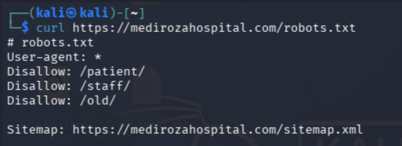</td>
    <td>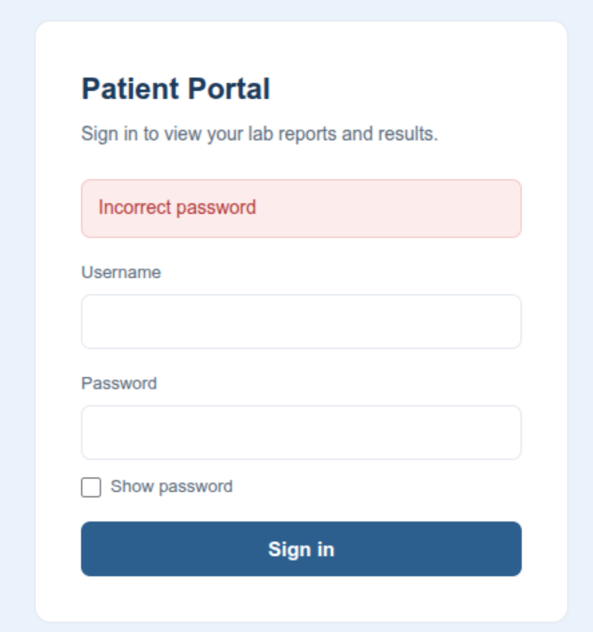</td>
    <td>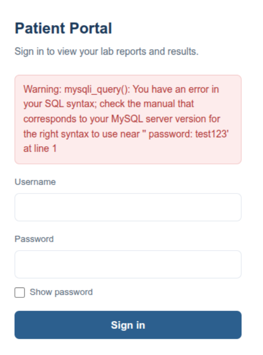</td>
  </tr>
</table>
successful login
<table>
  <tr>
    <td>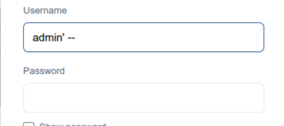</td>
    <td>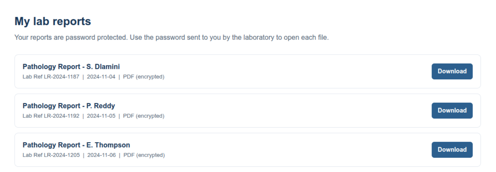</td>
  </tr>
</table>

## 2) Data Extraction
Goal: Cracking the encryption on all 3 retrieved files.

To crack the encryption of the reports, we find the hash value of each PDF file, and use it with an optional uploaded worldlist text file.
<table>
  <tr>
    <td>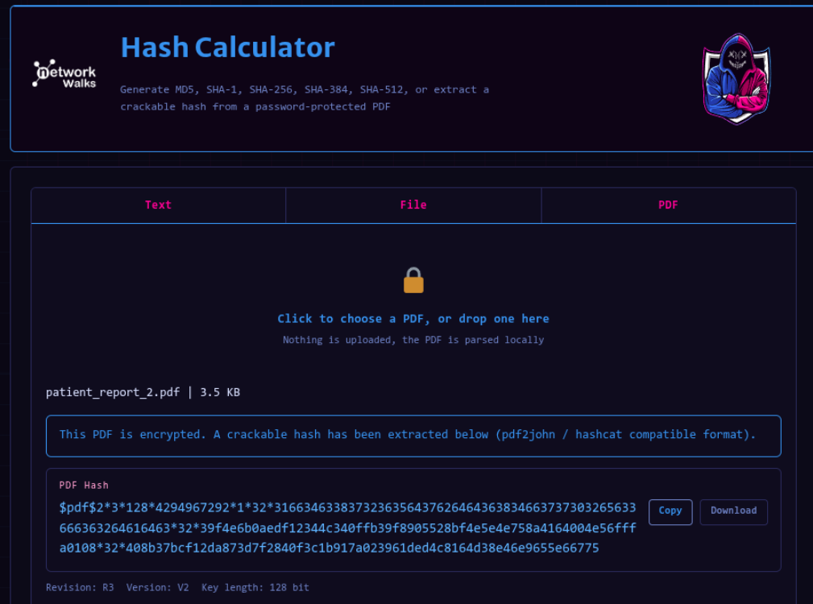</td>
    <td>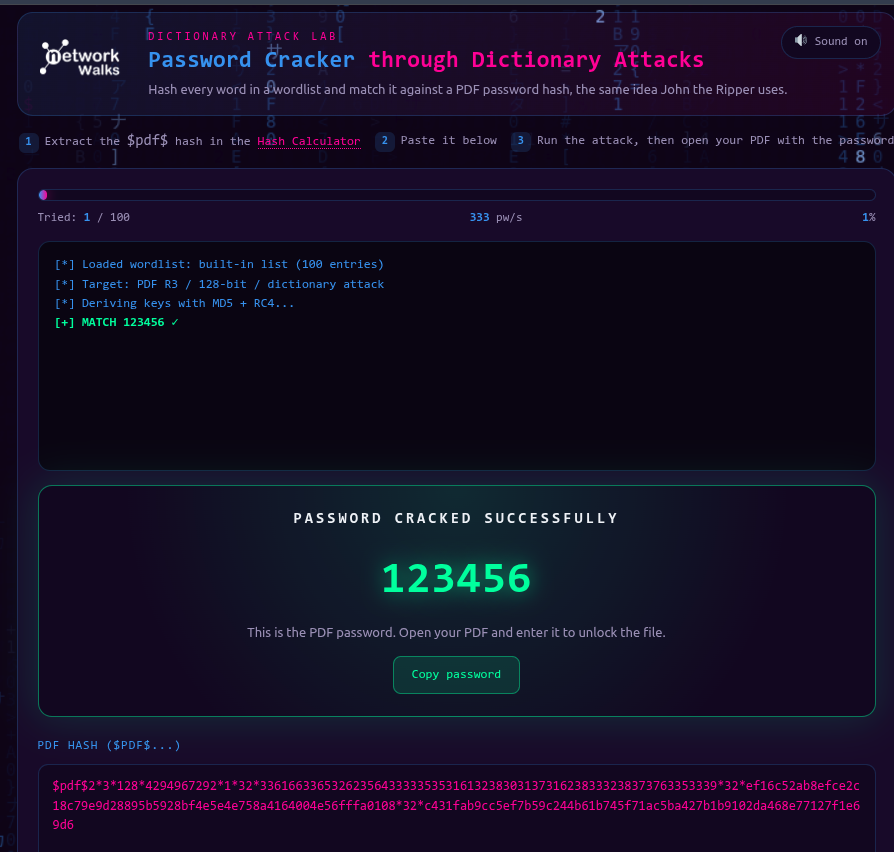</td>
  </tr>
</table>

| PDF | PASS | HASH |
|-----|------|------|
| Report-1 | 123456 | $pdf$2*3*128*4294967292*1*32*3361663365326235643333353531613238303137316238333238373763353339*32*ef16c52ab8efce2c18c79e9d28895b5928bf4e5e4e758a4164004e56fffa0108*32*c431fab9cc5ef7b59c244b61b745f71ac5ba427b1b9102da468e77127f1e69d6 |
| Report-2 | password | $pdf$2*3*128*4294967292*1*32*3166346338373236356437626464363834663737303265633666363264616463*32*39f4e6b0aedf12344c340ffb39f8905528bf4e5e4e758a4164004e56fffa0108*32*408b37bcf12da873d7f2840f3c1b917a023961ded4c8164d38e46e9655e66775 |
| Report-3 | !@#$%^& | $pdf$2*3*128*4294967292*1*32*3261393066326130336634386337323631306164373264323130316137616538*32*5090fa0a5dba99cb97c9d140cd23119428bf4e5e4e758a4164004e56fffa0108*32*58e03d692cf37b50b0b5eaa189fcbd372260a949c8992ad7b44fd13e2b40c1f8 |

##### ⭐️ Note
Keeping an unlocked copy of report 3 for later use.

We need to keep an unlocked copy so that metadata analysis tools can read all the file properties in the next milestone.

ℹ️ `qpdf` is a command line tool that can decrypt a password protected PDF and save a clean copy.
`qpdf --password='!@#$%^&' --decrypt patient_report_3.pdf report3_open.pdf`

## 3) Attack
Finding staff salaries and shareholder details of the hospital.

To find critical data exposure on the client server we read the metadata.

ℹ️ Metadata is hidden information stored inside a file, such as who created it, when, and with what software.

`exiftool` is a command line tool that reads and displays all metadata fields from any file type including PDFs. We can Run `exiftool` on the unlocked report (A locked PDF only shows Encryption).
`exiftool report3_open.pdf`

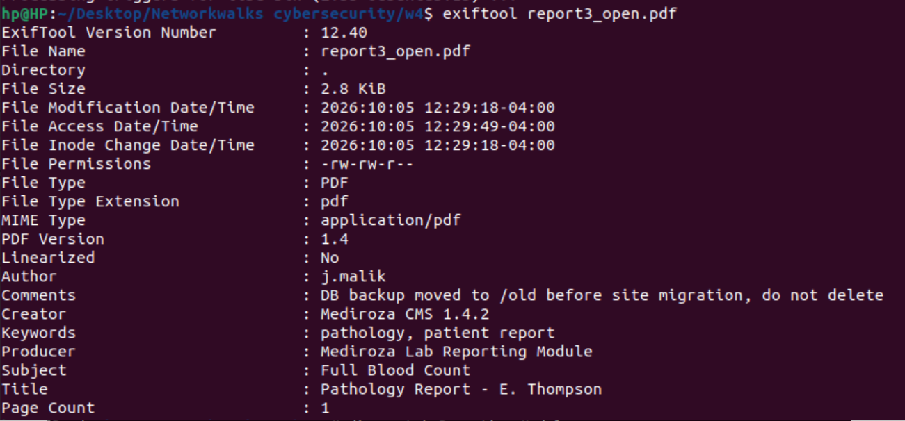

The Author's Comment leads us to an SQL File, we download it and view/extract the wanted information.

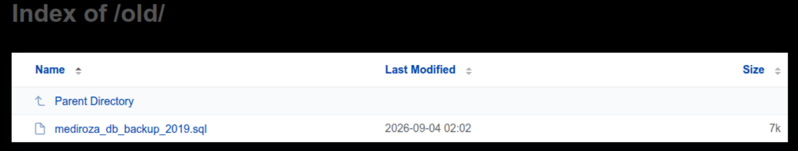

<table>
  <tr>
    <td>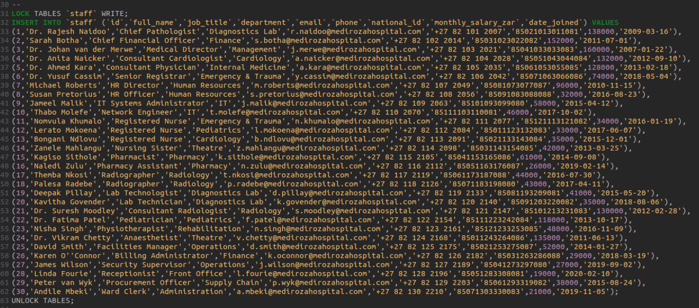</td>
    <td>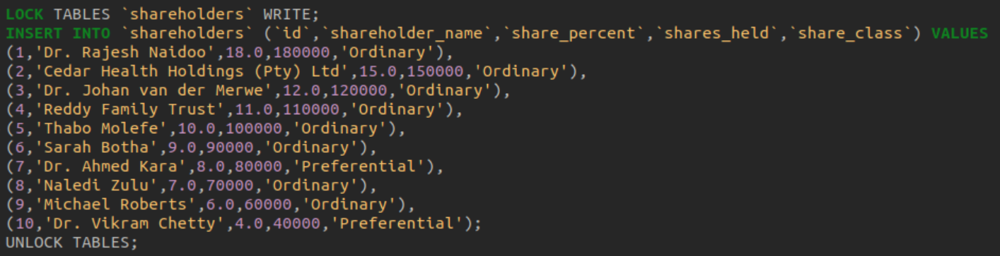</td>
  </tr>
</table>
<table>
  <tr>
    <td>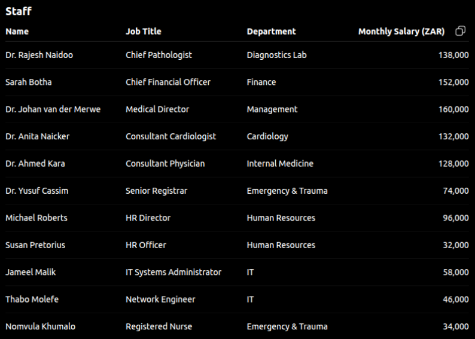</td>
    <td>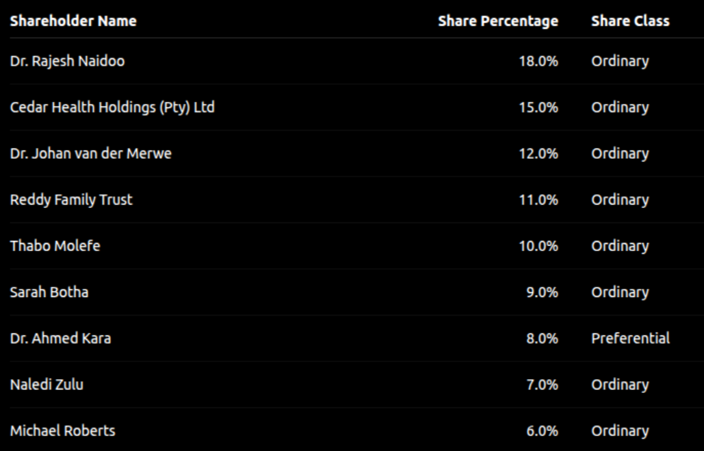</td>
  </tr>
</table>

## 4) Report
#### Findings
| no. | Vulnerability | Location | Risk |
|-----|---------------|----------|------|
| 1 | Username enumeration on login page | patient/login.php | Medium |
| 2 | SQL injection login bypass | patient/login.php | Critical |
| 3 | Encrypted PDFs accessible after login bypass | patient/reports/ | High |
| 4 | Weak PDF passwords crackable with a wordlist | patient_report_*.pdf | High |
| 5 | Sensitive metadata left in patient PDF files | patient_report_3.pdf | Medium |
| 6 | Forgotten backup folder with directory listing enabled | old/ | Critical |
| 7 | Confidential staff salaries and shareholder data in plain text | old/mediroza_db_backup_2019.sql | Critical |

#### Recommendation
1. Username enumeration: Show the same error message for a wrong username and a wrong password. Never reveal which one failed.
2. SQL injection: Use parameterised queries or prepared statements. Never build SQL queries using raw user input.
3. PDF access control: Store PDFs outside the web root or behind proper access controls. Use strong unique passwords per file.
4. PDF metadata: Strip all metadata from patient files before distributing. Use exiftool -all= filename.pdf to clean files.
5. Directory listing and backup exposure: Disable directory listing on all folders. Remove or relocate old backup files. Never store database backups in a public web folder.

---

_This document is for education purposes only. The target is owned/client by Networkwalks_
